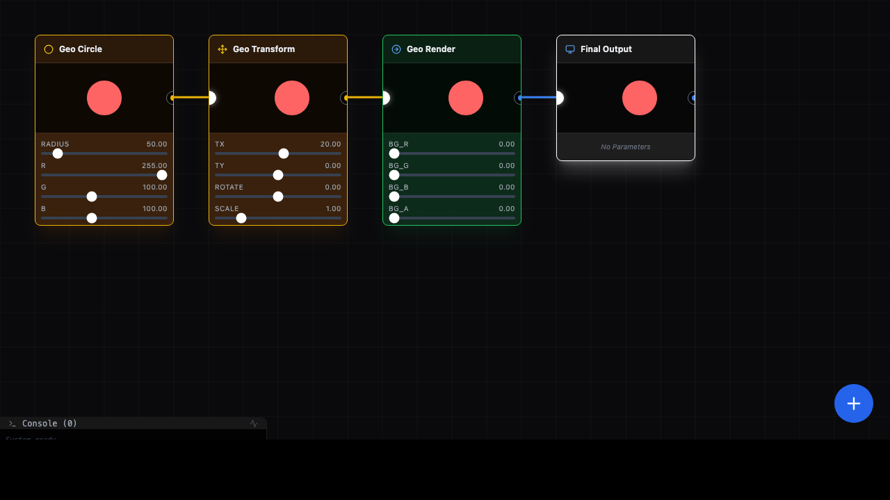

# P5 Node Studio



The primary goal of this project is to revolutionize **p5.js** coding by introducing a **node graph style interface**. This approach adds a new layer of operability and visual logic construction to traditional creative coding, allowing you to build generative art and graphics with a modular, visual workflow.

## Features

- **Node-Based Workflow**: Intuitively connect nodes to define data flow and transformations.
- **Real-Time Preview**: See changes instantly with a p5.js-powered rendering engine.
- **Live Code Editing**: Edit the logic of individual nodes using JavaScript/p5.js syntax.
- **Dynamic Parameters**: Automatically parses code to generate UI controls for parameters.
- **Modular Design**: Create reusable logic blocks for geometry and textures.

## Getting Started

### Prerequisites

- Node.js

### Installation

1. Clone the repository.
2. Install dependencies:
   ```bash
   npm install
   ```

### Running Locally

Start the development server:

```bash
npm run dev
```

Open your browser and navigate to the URL shown in your terminal (usually `http://localhost:5173`).

## Tech Stack

- **Framework**: React 19, TypeScript
- **Build Tool**: Vite
- **Graphics Engine**: p5.js
- **Styling**: Tailwind CSS
- **Icons**: Lucide React
